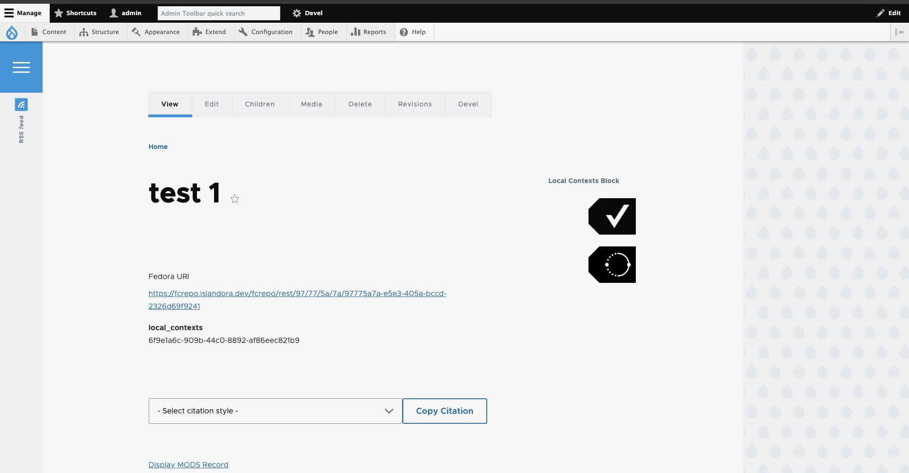
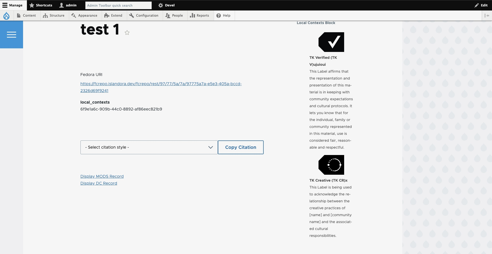

# Local Contexts Integration

## Description

The Local Contexts Integration module enhances your Drupal site by incorporating Traditional Knowledge (TK) Labels. This module facilitates the integration of these labels into your Drupal content, promoting the recognition and proper use of Indigenous cultural heritage.

## Prerequisites

Before installing the module, ensure your system meets the following requirements:

```bash
# Required software dependencies
PHP >= 7.4
Drupal >= 9.x
Composer >= 2.x
```

## Installation

To download/enable just this module, use the following from the command line:

```bash
composer require drupal/local_contexts_integration
drush en local_contexts_integration -y
```

## Usage

1. **Specify the Field for Project ID**:
   - You must specify an existing field or create your own field that will store the **Project ID**.
   - The module reads the **Project ID** from this designated field and retrieves the appropriate Traditional Knowledge labels.

2. **Automatic Display**:
   - The system automatically fetches and displays the relevant labels based on the stored **Project ID**.

## Screenshots

Below are examples of how the module integrates with Drupal content:



## Configuration

- **Specify the Field for Project ID**:
  - Navigate to **Configuration** > **web services** > **Local Contexts Integration**.
  - Speciify the field that will store the **Project ID**.
  - Ensure this field contains the project_id.

## License

This project is licensed under the MIT License. See the [LICENSE](https://www.gnu.org/licenses/old-licenses/gpl-2.0.txt) file for details.

## Maintainers

Current maintainer:

- **Name**: Brandon Weigel
- **Email**: <brandonw@bceln.ca>

For more information on the Local Contexts initiative, visit the [Local Contexts website](https://localcontexts.org/).
